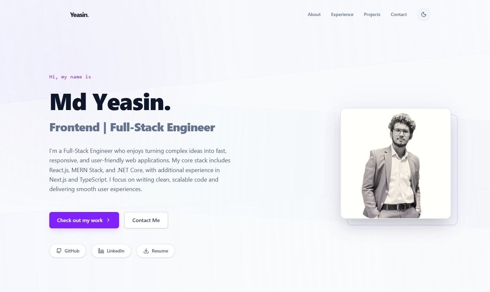

# Md Yeasin — Portfolio

A modern, responsive developer portfolio built with **Next.js 16**, **React 19**, and **Tailwind CSS 4**. Features dark/light theme, smooth scroll-spy navigation, animated UI, and interactive project modals.

---

## Preview



---

## Features

- **Dark / Light Theme** — persisted in `localStorage` with FOUC-free inline script
- **Scroll-Spy Navigation** — RAF-throttled, highlights the current section in the navbar
- **Animated Hero** — staggered fade-in-up entrance, floating profile image with hover effects
- **Skills Grid** — categorized (Frontend, Backend, Database, Tools & Cloud) with icon labels
- **Experience Timeline** — vertical timeline with tech tags per role
- **Project Showcase** — 4 card variants (Hero, Typographic, Split Visual, Banner) in a grid
- **Project Modal** — full-screen editorial layout with hero image, spec sheet, and action buttons
- **Contact Modal** — copy-email, LinkedIn, and GitHub quick links
- **Mouse Glow** — subtle radial gradient follows the cursor
- **Background Layers** — noise overlay + diagonal gradient bands
- **Mobile Responsive** — full-screen mobile menu, responsive grids, touch-friendly
- **Accessible** — keyboard nav, focus rings, aria labels, semantic HTML

---

## Tech Stack

| Layer     | Technology                          |
| --------- | ----------------------------------- |
| Framework | Next.js 16 (App Router, Turbopack)  |
| UI        | React 19, Tailwind CSS 4            |
| Icons     | lucide-react                        |
| Fonts     | Geist Sans & Geist Mono (next/font) |
| Images    | next/image with priority loading    |
| Modals    | next/dynamic (lazy-loaded, no SSR)  |
| Linting   | ESLint 9 + eslint-config-next       |

---

## Project Structure

```
src/
├── app/
│   ├── globals.css          # Tailwind imports, keyframes, scrollbar, theme
│   ├── layout.js            # Root layout, fonts, metadata, dark-mode script
│   └── page.jsx             # Main page — hooks (theme, scroll-spy, glow, scroll-lock)
├── components/
│   ├── BackgroundLayers.jsx  # Noise overlay, gradient bands, mouse glow
│   ├── Navigation.jsx        # Logo, desktop/mobile nav, theme toggle
│   ├── Hero.jsx              # Intro, CTAs, social pills, profile image
│   ├── About.jsx             # Bio, download CV, skills grid
│   ├── Experience.jsx        # Timeline with job entries & tech tags
│   ├── Projects.jsx          # 4 card types in a responsive grid
│   ├── Contact.jsx           # "Get In Touch" CTA section
│   ├── Footer.jsx            # Social links, copyright
│   ├── ContactModal.jsx      # Email copy, LinkedIn, GitHub cards
│   └── ProjectModal.jsx      # Full-screen project detail view
├── data/
│   └── portfolio.js          # All content: personal info, skills, experience, projects
public/
├── docs/                     # Resume & CV (PDF)
└── images/                   # Avatar & project screenshots
```

---

## Getting Started

### Prerequisites

- **Node.js** ≥ 18

### Install & Run

```bash
# Clone the repo
git clone https://github.com/ysncodex/yeasin-portfolio.git
cd yeasin-portfolio

# Install dependencies
npm install

# Start development server
npm run dev
```

Open **http://localhost:3000** to view the site.

### Build for Production

```bash
npm run build
npm start
```

---

## Customization

All portfolio content lives in a single file — **`src/data/portfolio.js`**:

| Section         | What to edit                                    |
| --------------- | ----------------------------------------------- |
| `PERSONAL_INFO` | Name, role, bio, email, socials, resume/CV path |
| `SKILLS`        | Skill categories and items                      |
| `EXPERIENCE`    | Job roles, companies, periods, descriptions     |
| `PROJECTS`      | Titles, descriptions, tech, images, links       |

Replace images in `public/images/` and documents in `public/docs/`.

---

## Scripts

| Command         | Description                  |
| --------------- | ---------------------------- |
| `npm run dev`   | Start dev server (Turbopack) |
| `npm run build` | Production build             |
| `npm start`     | Serve production build       |
| `npm run lint`  | Run ESLint                   |

---

## Deployment

Deploy instantly on [Vercel](https://vercel.com/new):

1. Push to GitHub
2. Import the repo on Vercel
3. Deploy — zero config needed

Or use any Node.js hosting that supports Next.js (Netlify, Railway, etc.).

---

## License

This project is open source and available under the [MIT License](LICENSE).

---

**Designed & Built by Md Yeasin © 2026**
