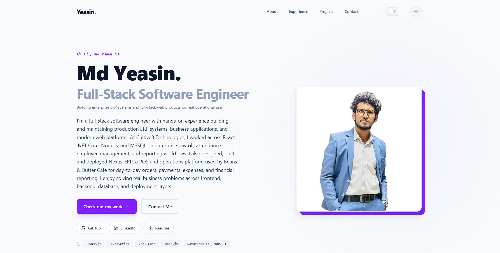

# Md Yeasin — Portfolio

Personal developer portfolio for **Md Yeasin**, a Full-Stack Software Engineer based in Dhaka, Bangladesh.

Built with **Next.js 16**, **React 19**, **TypeScript**, and **Tailwind CSS 4**.

**Live:** [yeasin-dev.netlify.app](https://yeasin-dev.netlify.app)

---

## Preview



---

## Features

- Responsive single-page portfolio
- Dark, light, and system theme support
- FOUC-free theme initialization
- Scroll-spy navigation
- Responsive mobile navigation
- `Ctrl/Cmd + K` command palette
- Professional experience timeline
- Impact metrics
- Interactive project case studies
- Keyboard-accessible modals
- Focus-trapped dialogs
- Copy-to-clipboard contact flow
- Reduced-motion support
- SEO metadata and structured data
- Open Graph and Twitter cards
- Dynamic sitemap and robots configuration
- Optimized fonts and images
- Netlify deployment

---

## Tech Stack

| Category   | Technology                    |
| ---------- | ----------------------------- |
| Framework  | Next.js 16                    |
| UI         | React 19                      |
| Language   | TypeScript                    |
| Styling    | Tailwind CSS 4                |
| Icons      | Lucide React                  |
| Fonts      | Geist Sans, Geist Mono        |
| Images     | Next.js Image                 |
| SEO        | Next.js Metadata API, JSON-LD |
| Linting    | ESLint 9                      |
| Deployment | Netlify                       |

---

## Project Structure

```text
src/
├── app/
│   ├── globals.css
│   ├── layout.tsx
│   ├── page.tsx
│   ├── sitemap.ts
│   ├── robots.ts
│   └── not-found.tsx
│
├── components/
├── data/
│   └── portfolio.ts
├── hooks/
│   └── useFocusTrap.ts
└── types/
    └── index.ts

public/
├── docs/
└── images/
```

---

## Getting Started

### Prerequisites

- Node.js 20+
- npm
- Git

### Installation

```bash
git clone https://github.com/ysncodex/yeasin-portfolio.git
cd yeasin-portfolio
npm install
```

Start the development server:

```bash
npm run dev
```

Open:

```text
http://localhost:3000
```

---

## Scripts

```bash
npm run dev
```

Start the development server.

```bash
npm run build
```

Create a production build.

```bash
npm start
```

Run the production build locally.

```bash
npm run lint
```

Run ESLint.

---

## Core Dependencies

```json
{
  "next": "16.1.6",
  "react": "19.2.3",
  "react-dom": "19.2.3",
  "typescript": "6.0.3",
  "tailwindcss": "^4",
  "lucide-react": "^0.577.0"
}
```

See [`package.json`](package.json) for the complete dependency list.

---

## Deployment

The project is deployed on **Netlify** using the official Next.js plugin.

Production deployments are triggered automatically from the `main` branch.

The application can also be deployed on Vercel or any platform supporting Next.js.

---

## Links

- **Portfolio:** [yeasin-dev.netlify.app](https://yeasin-dev.netlify.app)
- **GitHub:** [github.com/ysncodex](https://github.com/ysncodex)
- **LinkedIn:** [linkedin.com/in/yeasin7](https://www.linkedin.com/in/yeasin7/)
- **Email:** [yeasin7y@gmail.com](mailto:yeasin7y@gmail.com)

---

## License

This project is licensed under the terms defined in the [LICENSE](LICENSE) file.

---

<p align="center">
  <strong>Designed & built by <a href="https://yeasin-dev.netlify.app">Md Yeasin</a></strong>
  <br />
  Full-Stack Software Engineer
</p>
